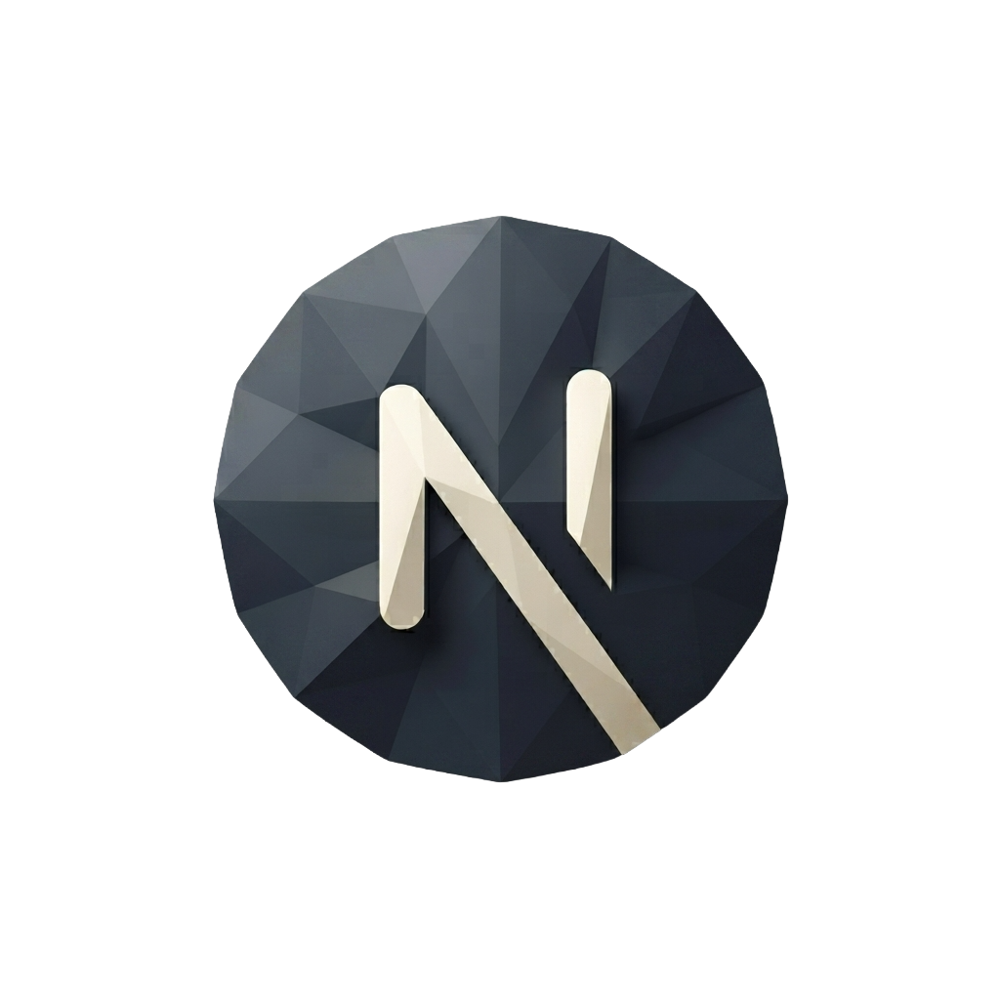

  

  

  
  

  
  
  
  
  

## ¿Qué es?

Frontend del portafolio de @Pokymon.dev. Sirve el sitio público (perfil,
casos de estudio, apertura de tickets) y el portal privado de cliente
(login, chat en vivo, cronograma, entregables).

## Stack

**Stack técnico:**

| Tecnología | Uso |
|---|---|
| Next.js 16 (App Router) | Framework, enrutamiento y renderizado |
| React 19 | Librería de UI |
| TypeScript | Tipado estático |
| Tailwind CSS 4 | Estilos |
| ESLint | Linting |

Renderizado: SSG/ISR para el sitio público, CSR autenticado para el portal.

## ¿Qué sirve?

- `/` — sitio público.
- `/tickets` — apertura y chat de tickets.
- `/client/dashboard` — portal de cliente (autenticado).
- Demo pública del portal, sin autenticación.

## Estructura esencial

- `app/` — rutas y páginas (App Router).
- `app/components/` — componentes de UI, incluida la landing.
- `app/hooks/` — hooks compartidos (p. ej. tema claro/oscuro).
- `app/tokens.css` — tokens de diseño centralizados.
- `public/icons/` — iconografía de marca.
- `.env.example` — variables de entorno de referencia.

## Desarrollo local

`npm install`, copiar `.env.example` a `.env.local`
(`NEXT_PUBLIC_BACKEND_URL=http://localhost:8080`), `npm run dev` →
`localhost:3000`. El backend se consume vía proxy Nginx en `:8080`, nunca
directamente en `:3001`.

## Repo relacionado

- [portfolio-api](https://github.com/PokyDev/portfolio-api) — backend de esta plataforma (Fastify + Socket.io + Prisma).

## Cronograma de desarrollo

| Día | Fecha | Frente | Tarea | Descripción |
|---|---|---|---|---|
| 0 | ≤ 05-jul-2026 | INFRA | ✅ Configuración de entorno local | Completado según `config_enviroment.md`: PostgreSQL 16 en Docker, Nginx como proxy inverso en `:8080` con soporte WebSocket y hardening de `:3001` (bind a loopback + header secreto), Next.js 16 con TypeScript/Tailwind, Fastify 5 + Socket.io integrados y probados a través del proxy, Prisma inicializado con migración de prueba, variables de entorno formalizadas con `.env.example` por app, y script automatizado de test de sockets. |
| 1 | 06-jul-2026 | AMBOS | Repositorios GitHub + higiene de versionado | Crear `portfolio-web` y `portfolio-api` según esta spec: `git init` por app, verificación de `.gitignore` (exclusión de `.env*`, inclusión de `.env.example`), README con la estructura de las secciones 2.2 y 3.2, push inicial a `main`, y vinculación de remotos con GitHub CLI (auth ya realizada). |
| 2 | 07-jul-2026 | API | Modelo de datos y migraciones Prisma | Reemplazar el modelo de prueba `HealthCheck` por el esquema real: `users` (roles admin/client), `tickets`, `ticket_messages`, `projects`, `conversations`, `messages`, `deliverables`, `deliverable_feedback`, `timeline_phases`. Ejecutar `prisma migrate dev`, crear seed mínimo (usuario admin), y documentar el modelo como spec en el repo. |
| 3 | 08-jul-2026 | API | Autenticación núcleo | Hashing Argon2id, generación criptográfica de contraseña provisional (12 caracteres, 4 tipos), endpoint de login, emisión de JWT de corta duración + refresh token, middleware RBAC (`admin`/`client`) y rate limiting con bloqueo progresivo en intentos fallidos (RNF-03, RNF-03b, RNF-03c). |
| 4 | 09-jul-2026 | API | Correo transaccional + 2FA + reset | Alta y validación del proveedor (Resend o Mailtrap) con correo de prueba; flujo de verificación de correo por código/link; activación de 2FA TOTP (RF-13b); flujo completo de restablecimiento de contraseña autónomo (RF-13c). |
| 5 | 10-jul-2026 | API | Sistema de tickets (backend) | Endpoints de apertura de ticket sin autenticación, verificación de correo previa a habilitar chat, generación de `ticket_token`, reenvío por correo de links de acceso a tickets abiertos (RF-08), y cierre de ticket con dos resoluciones: aceptación (dispara credenciales del portal, RF-12) o rechazo con notificación (RF-10). |
| 6 | 11-jul-2026 | API | Chat en tiempo real | Rooms/namespaces de Socket.io para chat de tickets y chat de proyectos, persistencia de todos los mensajes en PostgreSQL (RF-16), reutilización del `allowRequest` con header de gateway ya implementado, y disparo de notificaciones por correo ante actividad relevante (RF-11). |
| 7 | 12-jul-2026 | API | Portal de cliente (backend) + pruebas de permisos | Endpoints de cronograma, entregables y feedback sobre entregables (registro independiente, nunca edición del original, RF-18). Verificación de la matriz de permisos del rol `client` en cada endpoint de escritura y pruebas automatizadas de que ninguna ruta de escritura es alcanzable por `client` (RNF-03b). |
| 8 | 13-jul-2026 | WEB | Sitio público | Landing con perfil profesional (RF-01), casos de estudio con SSG/ISR (RF-02, RNF-04), sección de contacto con canal principal (tickets) y alternativo (WhatsApp/correo, RF-03), y demo pública del portal sin autenticación (RF-04). |
| 9 | 14-jul-2026 | WEB | Frontend de tickets | Formulario de apertura con advertencia destacada sobre el correo (RF-06), pantalla de verificación, UI del chat en vivo conectada al WebSocket vía `:8080`, persistencia del `ticket_token` en `localStorage` (RF-07) y flujo de recuperación por reenvío de links. |
| 10 | 15-jul-2026 | WEB | Frontend del portal de cliente | Login en `/client/dashboard` con soporte 2FA y componente de reset de contraseña, cambio de contraseña provisional con validación de complejidad (RF-13), vistas de solo lectura de cronograma y entregables, envío de feedback, y chat del proyecto (RF-14 a RF-19). |
| 11 | 16-jul-2026 | WEB | Panel de administración | Vistas de Javier (rol `admin`): bandeja de tickets con chat, cierre con aceptación/rechazo, generación manual de credenciales para clientes de canal alternativo (RF-12), y gestión de cronograma y entregables por proyecto. |
| 12 | 17-jul-2026 | AMBOS | Testing integral end-to-end local | Recorrido completo a través de Nginx: apertura de ticket → verificación de correo → chat → cierre con aceptación → recepción de contraseña provisional → login → cambio de contraseña → 2FA → portal completo. Verificación de estabilidad del WebSocket vía proxy, de la matriz de permisos y de todas las notificaciones por correo. Corrección de defectos encontrados. |
| 13 | 18-jul-2026 | INFRA | Despliegue del backend | Oracle Cloud (ARM): clonar `portfolio-api`, instalar dependencias, configurar `.env` de producción, replicar la configuración de Nginx validada en local (proxy + WebSocket + header de gateway), PostgreSQL de producción con migraciones, proceso bajo PM2, y DNS/TLS del subdominio `api.{dominio}` en Cloudflare. |
| 14 | 19-jul-2026 | INFRA | Despliegue del frontend + integración | Conectar `portfolio-web` a Vercel con despliegue automático, configurar `NEXT_PUBLIC_BACKEND_URL` de producción, DNS del dominio raíz en Cloudflare apuntando a Vercel, y verificación end-to-end del flujo completo en producción incluyendo WSS. |
| 15 | 20-jul-2026 | INFRA | Monitoreo y cierre de versión | Logs estructurados accesibles vía PM2 (RNF-07), verificación de reinicio automático, programación de backups de PostgreSQL, revisión final de hardening (headers, rate limiting, TLS), checklist de RF/RNF contra `project_description.md`, y tag de release `v1.0.0` en ambos repos. |