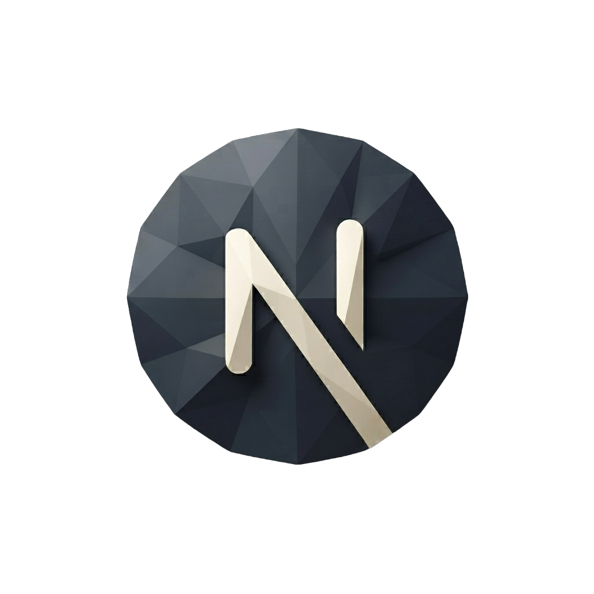

  

  

  
  

  
  
  
  
  

## ¿Qué es?

Frontend del portafolio de @Pokymon.dev. Sirve el sitio público (perfil,
casos de estudio, apertura de tickets) y el portal privado de cliente
(login, chat en vivo, cronograma, entregables).

## Stack

**Stack técnico:**

| Tecnología | Uso |
|---|---|
| Next.js 16 (App Router) | Framework, enrutamiento y renderizado |
| React 19 | Librería de UI |
| TypeScript | Tipado estático |
| Tailwind CSS 4 | Estilos |
| ESLint | Linting |

Renderizado: SSG/ISR para el sitio público, CSR autenticado para el portal.

## ¿Qué sirve?

- `/` — sitio público.
- `/tickets` — apertura y chat de tickets.
- `/client/dashboard` — portal de cliente (autenticado).
- Demo pública del portal, sin autenticación.

## Estructura esencial

- `app/` — rutas y páginas (App Router).
- `app/components/` — componentes de UI, incluida la landing.
- `app/hooks/` — hooks compartidos (p. ej. tema claro/oscuro).
- `app/tokens.css` — tokens de diseño centralizados.
- `public/icons/` — iconografía de marca.

## Desarrollo local

`npm install`, crear `.env.local` (no versionado, no distribuido) con
`NEXT_PUBLIC_BACKEND_URL=http://localhost:8080`, `npm run dev` →
`localhost:3000`. El backend se consume vía proxy Nginx en `:8080`, nunca
directamente en `:3001`. No se distribuye ningún archivo `.env.example`.

## Repo relacionado

- [portfolio-api](https://github.com/PokyDev/portfolio-api) — backend de esta plataforma (Fastify + Socket.io + Prisma).

## Cronograma de desarrollo

> Se simplifica temporalmente a una única fase activa (frente WEB, landing page). El detalle multi-día de backend/infra/resto del sitio se retoma como fases siguientes una vez cerrada esta.

### Fase 1 — Landing page

**Completado**

| Tarea | Descripción |
|---|---|
| ✅ Estilado y tokens CSS generales | Definición del sistema de diseño base (`tokens.css`) que alimenta el theming claro/oscuro y los estilos de la landing. |
| ✅ Layout, responsividad y navegación | Estructura de layout de la landing, comportamiento responsivo y navegación funcional tanto en desktop como en mobile (incluye `NavMovil.tsx`). |

**Pendiente**

| Tarea | Descripción |
|---|---|
| Ubicación semántica del contenido | Evaluar si `app/components/` es el nombre correcto para la carpeta que contiene `Landing.tsx` y sus subcomponentes, o si debería renombrarse (p. ej. a algo más cercano a `pages/`) dado que `app/page.tsx` solo renderiza este componente. |
| Reestructuración de carpetas y estilos | `Landing.tsx`, sus componentes hijos y varios `.css`/`.module.css` (incluido `landing.module.css`, ~2900 líneas) conviven hoy en el mismo directorio plano. Definir una organización más clara (subcarpetas por componente, separación de estilos) para mejorar la mantenibilidad. |
| Posición del botón de scroll en mobile | Encontrar la ubicación adecuada para `ScrollButtons.tsx` en la vista mobile. |
| Revisión de contenido/copy | Corregir errores de redacción y eliminar redundancia en el contenido textual de la landing para elevar la calidad percibida del portafolio. |